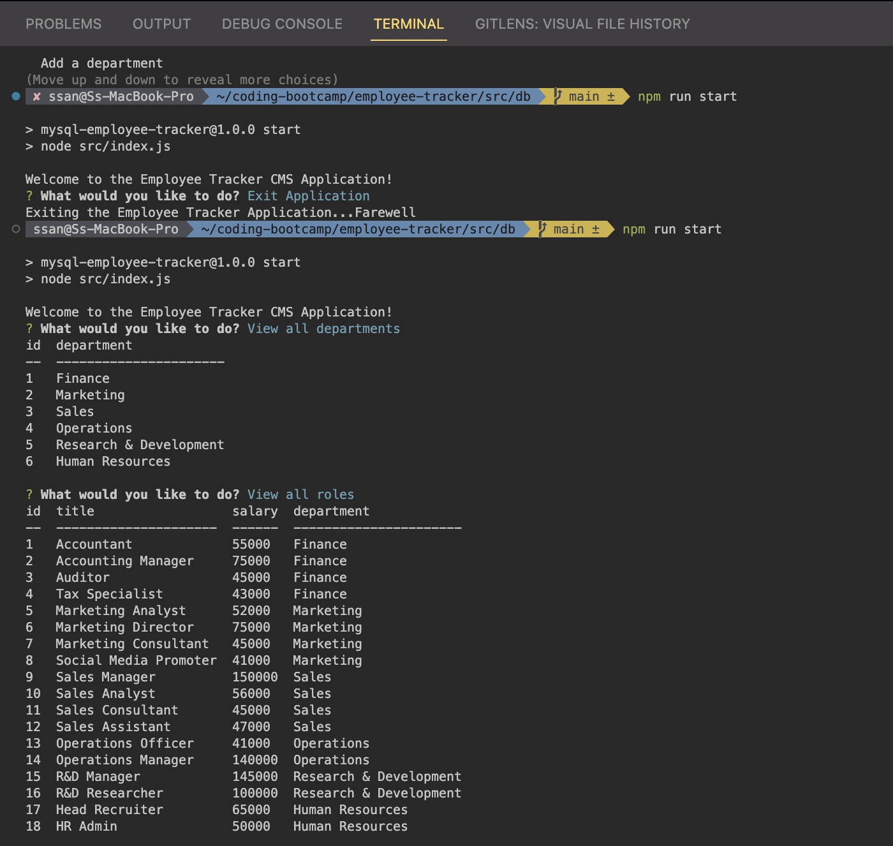

# employee-tracker 

## Table of Contents

- [Description](#description)
- [Installation](#installation)
- [Usage](#usage)
- [Contributing](#contributing)
- [Tests](#tests)
- [Questions](#questions)

## Description

A command-line application that manages a company's employee database, using Node.js, Inquirer, and MySQL.

## Deployed Link

N/A

## Github Repository Link

https://github.com/ss12932/employee-tracker

## Video Walkthrough Link

Due to Screencastify's 5 minute limit on the videos, I have to split the video into 4 parts. Sorry for the inconvenience!

- [Part 1 Video Walkthrough](https://drive.google.com/file/d/1boaf6vZDiZq_7hbBd8N-H3I6wI3Yqm_9/view)
- [Part 2 Video Walkthrough](https://drive.google.com/file/d/1wtLr31nGubKaXHyFLYuxSM4gjSHEOMB8/view)
- [Part 3 Video Walkthrough](https://drive.google.com/file/d/1qvOq0kPjl1gat7E2bbmvv2SG1nwPQjtV/view)
- [Part 4 Video Walkthrough](https://drive.google.com/file/d/1AWgzpNRfa2MFcvYh29cV5ZkPJbmtEH-e/view)

## Screenshot

## Installation

Please follow the instructions below:
Before installation of this application, please ensure you have the MySQL database installed on your local machine. If you don't have it, please refer to the documentation on the official MySQL website:

https://dev.mysql.com/doc/mysql-shell/8.0/en/mysql-shell-install.html

This requires the use of your command line terminal, navigate to your local directory of choice and perform a git clone of this application:

`git clone https://github.com/ss12932/employee-tracker.git`.

Afterwards, navigate to the application you just cloned:

`cd employee-tracker`

and do a

`code .`

to open it in your VS Code. Once opened in your VS IDE, do a

`npm install` or `npm i`

to install all dependencies required to run this application.

## Usage

Please follow the instructions below:

To initiate this application in your integrated terminal, please run:

`npm run start`.

This will start the application in your CLI. Hope you enjoy using the employee-tracker application!

## License

This Project is licensed under the MIT License, for more information please visit: [License](https://choosealicense.com/licenses/mit/)

## Contributing

None

## Tests

Please follow the instructions below:

None

## Questions

Please contact me on my email: ss12932@my.bristol.ac.uk
